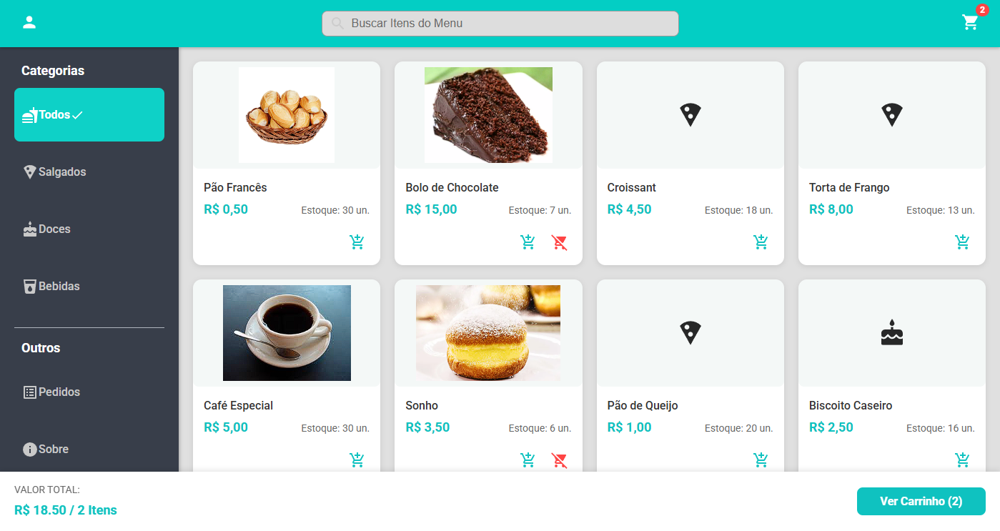
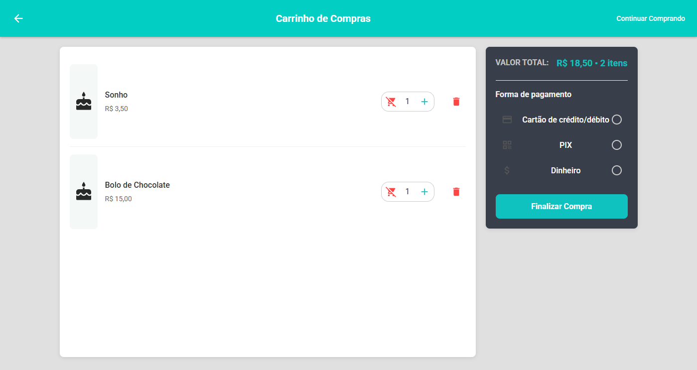
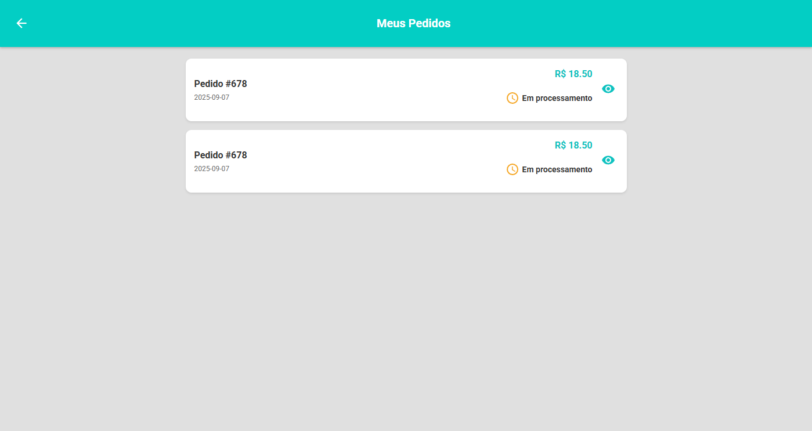

Padaria Digital: Sistema de Cardápio e Pedidos Online
Sobre o Projeto
Este projeto é um sistema de e-commerce e cardápio digital desenvolvido como parte da disciplina de Desenvolvimento Web do curso de Sistemas de Informação na Faculdade Wyden Unifacimp.

O objetivo principal é criar uma plataforma que possa substituir o tradicional cardápio físico de um restaurante ou padaria, permitindo que os clientes naveguem pelos produtos e façam pedidos diretamente pelo celular ou computador de forma rápida e intuitiva.

Funcionalidades (Features)
Navegação por Categorias: Os usuários podem filtrar os itens por categorias como "Salgados", "Doces" e "Bebidas".

Busca Dinâmica: Um campo de busca permite encontrar produtos específicos em tempo real.

Gerenciamento de Carrinho: Adicione, remova e ajuste a quantidade de itens no carrinho de compras.

Controle de Estoque: O sistema gerencia a quantidade de itens disponíveis e avisa quando um produto está esgotado.

Detalhes do Pedido: Uma tela de resumo mostra o valor total do pedido e permite a seleção da forma de pagamento (Dinheiro, PIX ou Cartão).

Histórico de Pedidos: A tela de pedidos permite visualizar o status e detalhes de todas as compras realizadas, incluindo número do pedido, data e valor total.

Sistema de Autenticação: Páginas dedicadas para Login e Cadastro de usuários, garantindo uma experiência personalizada. A navegação do menu lateral e o botão de perfil no topo do cabeçalho são dinâmicos, mudando de acordo com o status de login do usuário.

🛠️ Tecnologias e Linguagens Utilizadas
Linguagens: HTML, CSS, JavaScript (ES6+), JSX

Frameworks/Bibliotecas:

React JS: Para a construção da interface de usuário.

React Router DOM: Para gerenciar a navegação entre as páginas.

Context API: Para gerenciar o estado global da aplicação (carrinho de compras e autenticação de usuário).

Design: CSS puro

Ícones: React Icons

🚀 Como Executar o Projeto Localmente
Siga os passos abaixo para ter uma cópia do projeto em sua máquina para fins de desenvolvimento e teste.

Pré-requisitos
Certifique-se de que você tem o Node.js e o npm (ou yarn) instalados em sua máquina.

1. Clonar o Repositório
Abra o terminal e execute o comando abaixo para clonar o projeto:

Bash

git clone https://github.com/seu-usuario/nome-do-seu-repositorio.git
2. Instalar as Dependências
Navegue para o diretório do projeto e instale as bibliotecas necessárias:

Bash

cd nome-do-seu-repositorio
npm install
# ou
yarn
3. Iniciar o Servidor
Inicie a aplicação em modo de desenvolvimento. A aplicação será aberta automaticamente no seu navegador padrão.

Bash

npm start
# ou
yarn start
A aplicação estará disponível em http://localhost:3000.

📸 Telas do Aplicativo
(Aqui você pode inserir as imagens das telas que você tirou. Crie uma pasta chamada assets ou images no seu repositório, coloque as imagens lá e use a sintaxe Markdown para mostrá-las aqui. Por exemplo: )

Dashboard:
(Insira sua imagem aqui)

Carrinho de Compras:

Histórico de Pedidos:

Tela de Login/Cadastro:

